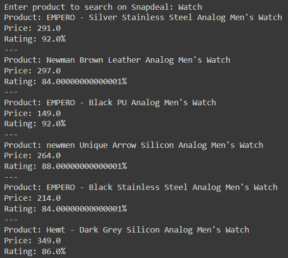

### EX8 Web Scraping On E-commerce platform using BeautifulSoup

### AIM: To perform Web Scraping on Amazon using (beautifulsoup) Python.
### Description: 
<div align = "justify">
Web scraping is the process of extracting data from various websites and parsing it. In other words, it’s a technique 
to extract unstructured data and store that data either in a local file or in a database. 
There are many ways to collect data that involve a huge amount of hard work and consume a lot of time. Web scraping can save programmers many hours. Beautiful Soup is a Python web scraping library that allows us to parse and scrape HTML and XML pages. 
One can search, navigate, and modify data using a parser. It’s versatile and saves a lot of time.
<p>The basic steps involved in web scraping are:
<p>1) Loading the document (HTML content)
<p>2) Parsing the document
<p>3) Extraction
<p>4) Transformation

### Procedure:

1) Import necessary libraries (requests, BeautifulSoup, re, matplotlib.pyplot).
2) Define convert_price_to_float(price) Function: to Remove non-numeric characters from a price string and convert it to a float.
3) Define get_amazon_products(search_query) Function: to Scrape Amazon for product information based on the search query.
4) Fetch and parse the HTML content then Extract product names and prices from the search results and Sort product information based on converted prices in ascending order.
5) Return sorted product data as a list of dictionaries.
6) Call get_amazon_products(search_query) to get product data based on the user's search query.
7) Check if products are found; if not, display "No products found."
8) Visualize Product Data using a Bar Chart

### Program:
```PYTHON
import requests
from bs4 import BeautifulSoup
import matplotlib.pyplot as plt
import re

def convert_price_to_float(price_str):
    # Remove currency symbols and commas, then convert to float
    clean_price = re.sub(r'[^\d.]', '', price_str)  # Keep digits and decimal point
    return float(clean_price) if clean_price else 0.0

def get_snapdeal_products(search_query):
    url = f'https://www.snapdeal.com/search?keyword={search_query.replace(" ", "%20")}'
    headers = {
        'User-Agent': 'Mozilla/5.0 (Windows NT 10.0; Win64; x64) AppleWebKit/537.36 (KHTML, like Gecko) Chrome/98.0.4758.102 Safari/537.36'
    }

    response = requests.get(url, headers=headers)
    products_data = []

    if response.status_code == 200:
        soup = BeautifulSoup(response.content, 'html.parser')
        products = soup.find_all('div', {'class': 'product-tuple-listing'})

        for product in products:
            title = product.find('p', {'class': 'product-title'})
            price = product.find('span', {'class': 'product-price'})
            if price:
                product_price = convert_price_to_float(price.get('data-price', '0'))
            else:
                product_price = 0.0  # Default to 0 if no price found
            rating = product.find('div', {'class': 'filled-stars'})  # Assuming rating is shown with this class

            if title and price:
                product_name = title.text.strip()
                #product_price = re.sub(r'[^\d.]', '', price.text.strip())  # Remove non-numeric chars for price
                product_rating = rating['style'].split(';')[0].split(':')[-1] if rating else "No rating"
                products_data.append({
                    'Product': product_name,
                    'Price': float(product_price),
                    'Rating': product_rating
                })
                print(f'Product: {product_name}')
                print(f'Price: {product_price}')
                print(f'Rating: {product_rating}')
                print('---')

    else:
        print('Failed to retrieve content')

    return products_data

# Main execution block
if __name__ == "__main__":
    search_query = input('Enter product to search on Snapdeal: ')
    products = get_snapdeal_products(search_query)

def visualize_product_data(products):
    if products:
        # Preparing data for plotting
        #product_names = [product['Product'][:25] + '...' if len(product['Product']) > 25 else product['Product'] for product in products]
        product_names = [product['Product'] for product in products]
        product_prices = [product['Price'] for product in products]

        # Creating the bar chart
        plt.figure(figsize=(12, 8))
        bars = plt.barh(product_names, product_prices, color='skyblue')  # Horizontal bar chart

        plt.xlabel('Price in INR')  # Label for x-axis
        plt.ylabel('Product')  # Label for y-axis
        plt.title(f'Prices of Products on Snapdeal')
        plt.tight_layout()
        # Displaying the plot
        plt.show()
    else:
        print('No products to display.')
visualize_product_data(products)

```

### Output:



### Result:

Thus, To perform Web Scraping on Amazon using (beautifulsoup) Python has been executed successfully.
